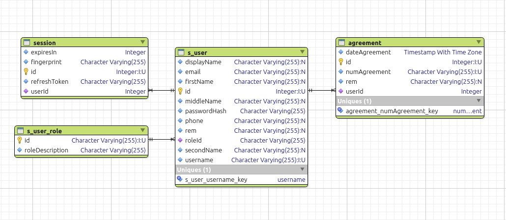

<p align="center">
  <a href="https://drone.io/" target="blank"></a>
  <a href="https://docker.com/" target="blank"></a>
  <a href="http://nestjs.com/" target="blank"></a>
  <a href="https://sequelize.org/v5/" target="blank"></a>
  <a href="https://graphql.org/" target="blank"></a>
  <a href="https://jwt.io/" target="blank"></a>
  <a href="https://www.postgresql.org/" target="blank"></a>
</p>

## Описание

Backend GraphQL application (проект в разработке!).

## Установка

```bash
$ yarn install
```

## Запуск приложения

```bash
# develop
$ yarn start

# watch mode
$ yarn start:dev

# production mode
$ yarn start:prod
```
## Реализованная схема БД (PostgreSQL 12)


## Оставайтесь на связи

- Author - [Roman Karas](https://www.facebook.com/roman.karas.98)
- Telegram - [@roman_t2](https://t.me/roman_t2)

## Лицензия

This project is [ISC licensed](https://gitlab.com/roman7722/nestjs-gql-api/blob/develop/LICENCE).
